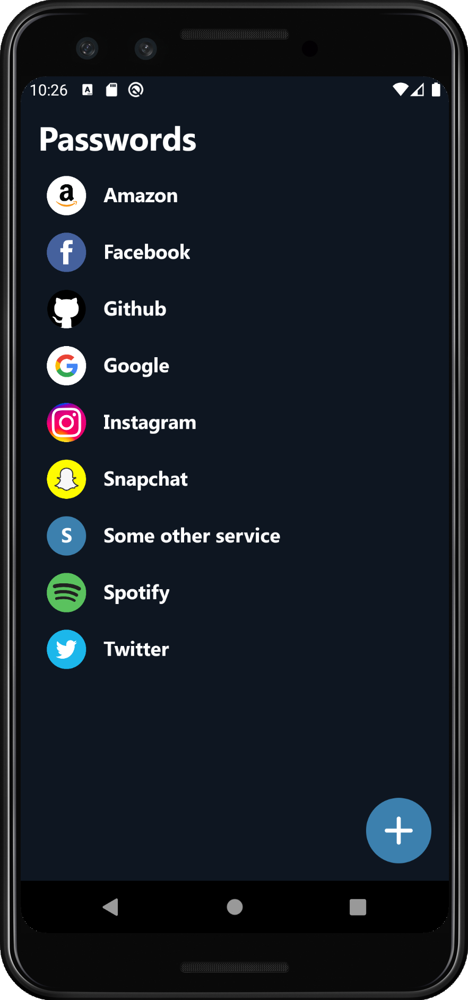
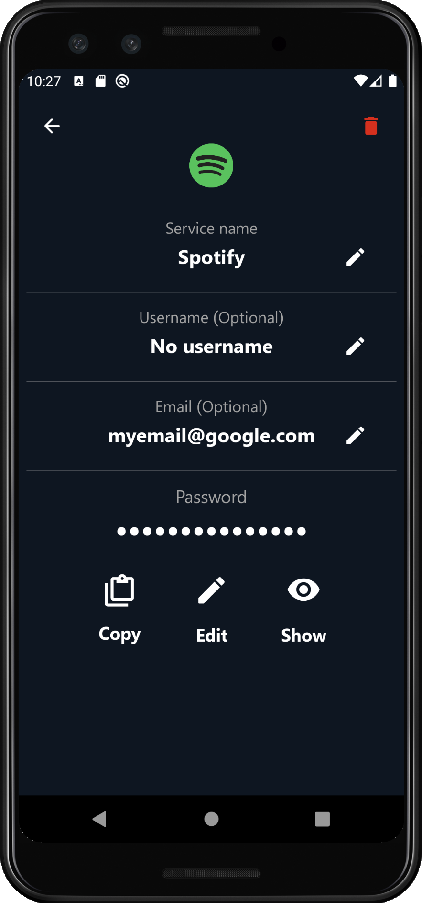
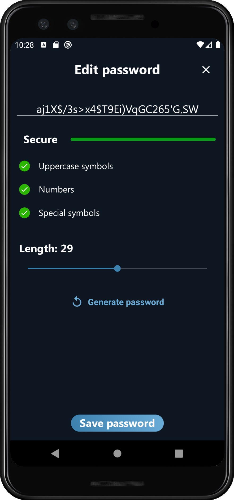

# Vault

### Secure, fast, simple and beautiful password manager

### [Download apk](android-app/apk/app-debug.apk)

#### Screenshots:

  
   
  
   
  

#### Technology stack:

- Kotlin
- MVP (Moxy)
- Unit testing (junit)
- Custom navigation
- Custom UI library

#### Main features:

- [x] Start screen
- [x] Creating master password screen
- [x] Cryptography algorithm
- [x] Checking password screen
- [x] Passwords list screen
- [x] Creating service screen
- [x] Password editing screen

#### In progress:

- [x] Unit-tests for cryptohraphy
- [x] Dagger 2
- [ ] Light theme
- [ ] Sharing secret file
- [ ] UI tests
