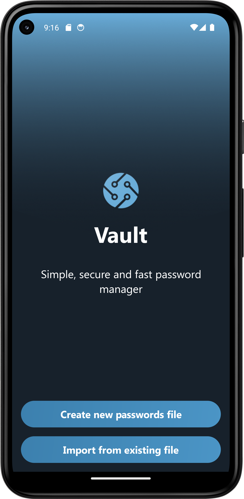
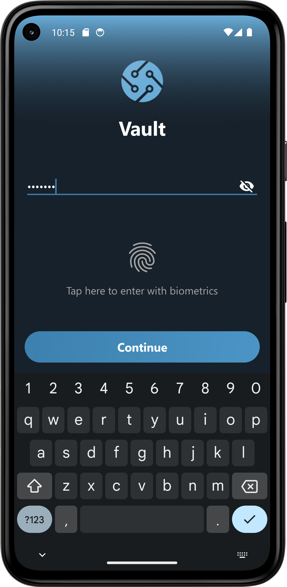
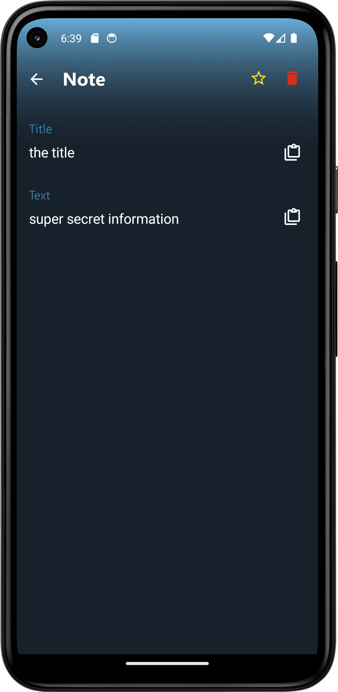

# Vault

### Secure, simple and fast password manager

Vault is a password manager that hepls you keep your passwords and other sensitive data organized. It is based on **kdbx** format that is used by [KeePass](https://keepass.info/), which means that it is compatible with every KeePass-based password manager. It is fast, secure and has an intuitive UX – everything you need from a reliable password manager.

### [Download apk](android-app/apk/vault.apk)

#### Screenshots:

  
   
  
  
   

   
  
  
   

