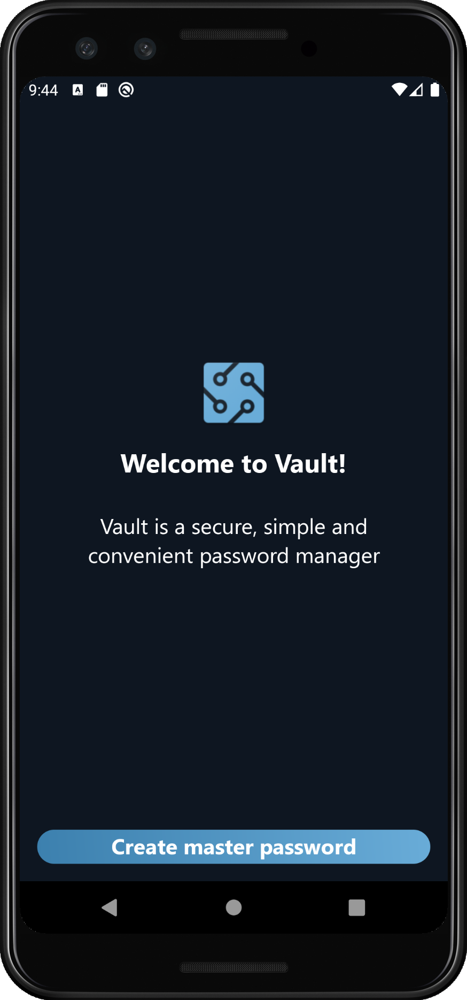

# Vault

### An android-based, simple, and secure password manager

#### Technology stack:
- Kotlin
- MVP (Moxy)
- Unit testing (junit)
- Custom navigation
- Custom UI library

#### Screenshots:

  
   
  
   
  

#### Progress:
- [x] Start screen
- [x] Creating master password screen
- [x] Cryptography algorithm
- [x] Checking password screen
- [x] Passwords list screen
- [x] Creating service screen
- [x] Password editing screen

#### Additional features:
- [ ] Light theme
- [ ] Sharing secret file
- [x] Unit-tests for cryptohraphy
- [ ] UI tests
