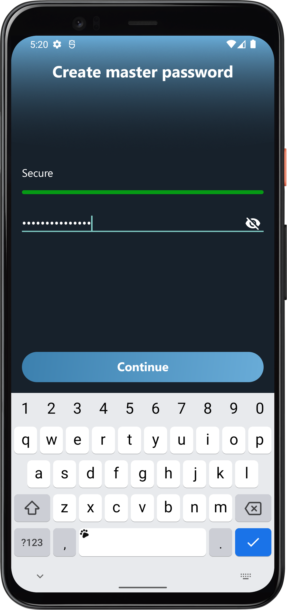

# Vault

### Secure, simple and fast password manager

Vault uses modern AES-SIV encryption algorithm with two keys 256 bits each. The app stores your password
locally, without uploading them to a remote server, so you have full control over what happens to
your file. It is fast, secure and has an intuitive UX – everything you need from a reliable password manager.

### [Download apk](android-app/apk/vault.apk)

#### Screenshots:

  
   
  
   

  
   
  
   

  
  
  
  

#### Technology stack:

- Kotlin
- Custom cicerone-like navigation
- Custom UI library
- MVI architecture
- Coroutines
